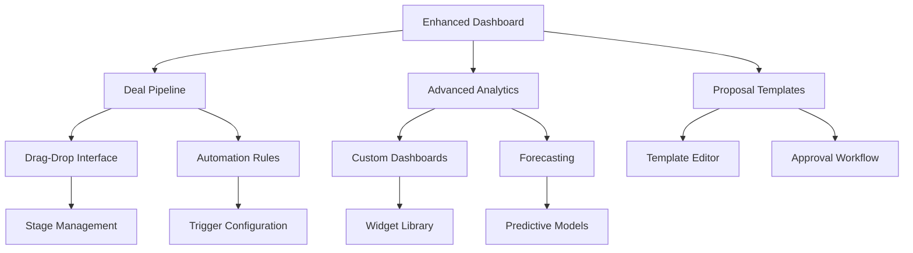

# Phase 2: Advanced Features & User Experience Enhancement

## 1. Product Overview

Phase 2 of Nawras CRM focuses on implementing advanced features and comprehensive UX improvements while maintaining strict backward compatibility. This phase introduces enhanced deal pipeline management, advanced analytics capabilities, proposal template systems, automated workflows, and significant user experience optimizations.

- **Primary Goal**: Enhance user productivity through advanced features and intuitive interactions
- **Target Users**: Existing CRM users seeking advanced functionality and improved workflow efficiency
- **Market Value**: Positions Nawras CRM as a comprehensive enterprise-grade solution with advanced automation and analytics capabilities

## 2. Core Features

### 2.1 User Roles

| Role | Registration Method | Core Permissions |
|------|---------------------|------------------|
| Standard User | Existing email registration | Access to enhanced features, custom dashboards, basic automation |
| Power User | Admin upgrade | Advanced analytics, workflow creation, template management |
| Administrator | System admin assignment | Full system configuration, user management, advanced monitoring |

### 2.2 Feature Module

Our Phase 2 enhancement consists of the following main feature areas:

1. **Enhanced Deal Pipeline**: Drag-and-drop functionality, stage customization, automated progression rules
2. **Advanced Analytics Dashboard**: Custom KPI tracking, interactive charts, performance forecasting
3. **Proposal Template System**: Customizable templates, automated generation, approval workflows
4. **Automated Workflow Engine**: Lead nurturing sequences, follow-up automation, trigger-based actions
5. **Advanced Search & Filtering**: Global search, saved filters, intelligent suggestions
6. **UX Enhancement Suite**: Responsive optimization, loading states, error handling improvements

### 2.3 Page Details

| Page Name | Module Name | Feature Description |
|-----------|-------------|---------------------|
| Enhanced Deal Pipeline | Drag-Drop Interface | Implement drag-and-drop deal movement between stages with visual feedback and validation |
| Enhanced Deal Pipeline | Stage Customization | Allow users to create, modify, and reorder pipeline stages with custom properties |
| Enhanced Deal Pipeline | Automated Rules | Configure automatic deal progression based on criteria like time, value, or activities |
| Advanced Analytics | Custom Dashboards | Create personalized dashboards with configurable widgets and KPI tracking |
| Advanced Analytics | Interactive Charts | Implement drill-down capabilities, filtering, and real-time data visualization |
| Advanced Analytics | Performance Forecasting | Provide predictive analytics for revenue forecasting and trend analysis |
| Proposal Templates | Template Management | Create, edit, and organize reusable proposal templates with dynamic content |
| Proposal Templates | Automated Generation | Generate proposals automatically using customer data and selected templates |
| Proposal Templates | Approval Workflows | Implement multi-stage approval processes with notifications and tracking |
| Workflow Engine | Lead Nurturing | Create automated email sequences and follow-up tasks based on lead behavior |
| Workflow Engine | Trigger Management | Configure event-based triggers for automated actions and notifications |
| Workflow Engine | Activity Automation | Automate routine tasks like data entry, status updates, and reminders |
| Advanced Search | Global Search | Implement unified search across all modules with intelligent ranking |
| Advanced Search | Saved Filters | Allow users to save and share complex filter combinations |
| Advanced Search | Smart Suggestions | Provide autocomplete and suggested searches based on user behavior |
| UX Enhancements | Responsive Design | Optimize all interfaces for mobile and tablet devices with touch interactions |
| UX Enhancements | Loading States | Implement skeleton screens and progress indicators for better perceived performance |
| UX Enhancements | Error Handling | Provide comprehensive error messages with suggested actions and recovery options |
| UX Enhancements | Keyboard Shortcuts | Add power user shortcuts for common actions and navigation |
| UX Enhancements | Accessibility | Ensure WCAG 2.1 AA compliance with screen reader support and keyboard navigation |

## 3. Core Process

### Enhanced User Workflow

Users will experience improved workflows through:

1. **Dashboard Customization Flow**: Users access analytics → customize dashboard → configure widgets → save layouts
2. **Deal Management Flow**: Users view pipeline → drag deals between stages → configure automation rules → monitor progress
3. **Proposal Creation Flow**: Users select template → customize content → generate PDF → submit for approval → track status
4. **Workflow Setup Flow**: Users define triggers → configure actions → test automation → activate workflows

### Power User Flow

1. **Advanced Analytics**: Access custom dashboards → drill down into metrics → export reports → schedule automated reports
2. **Template Management**: Create templates → define variables → set approval rules → publish for team use
3. **Workflow Administration**: Design complex workflows → set conditional logic → monitor performance → optimize rules

## 4. User Interface Design

### 4.1 Design Style

- **Primary Colors**: Enhanced blue palette (#3B82F6, #1E40AF, #60A5FA)
- **Secondary Colors**: Expanded gray scale (#F8FAFC, #E2E8F0, #64748B)
- **Accent Colors**: Success (#10B981), Warning (#F59E0B), Error (#EF4444), Info (#06B6D4)
- **Button Styles**: Rounded corners (8px), subtle shadows, hover animations
- **Typography**: Inter font family, 14px base size, improved line heights
- **Layout**: Card-based design with improved spacing, responsive grid system
- **Icons**: Lucide React with consistent 20px sizing, contextual colors
- **Animations**: Smooth transitions (200ms), loading spinners, progress indicators

### 4.2 Page Design Overview

| Page Name | Module Name | UI Elements |
|-----------|-------------|-------------|
| Enhanced Deal Pipeline | Drag-Drop Interface | Kanban-style columns, smooth drag animations, drop zones with visual feedback, stage headers with deal counts |
| Advanced Analytics | Custom Dashboards | Grid-based widget layout, resizable panels, color-coded metrics, interactive charts with hover states |
| Proposal Templates | Template Editor | Rich text editor, drag-drop components, live preview, sidebar with template library |
| Workflow Engine | Visual Builder | Flowchart interface, connector lines, condition nodes, action blocks with icons |
| Advanced Search | Global Search | Unified search bar, dropdown filters, result categories, highlighted matches |
| UX Enhancements | Loading States | Skeleton screens matching content structure, progress bars, spinner animations |

### 4.3 Responsiveness

Desktop-first approach with comprehensive mobile optimization:
- **Breakpoints**: Mobile (320px+), Tablet (768px+), Desktop (1024px+), Large (1440px+)
- **Touch Optimization**: Minimum 44px touch targets, swipe gestures, pull-to-refresh
- **Navigation**: Collapsible sidebar on mobile, bottom navigation for key actions
- **Content Adaptation**: Stacked layouts on mobile, horizontal scrolling for tables
- **Performance**: Lazy loading, image optimization, reduced animations on mobile
