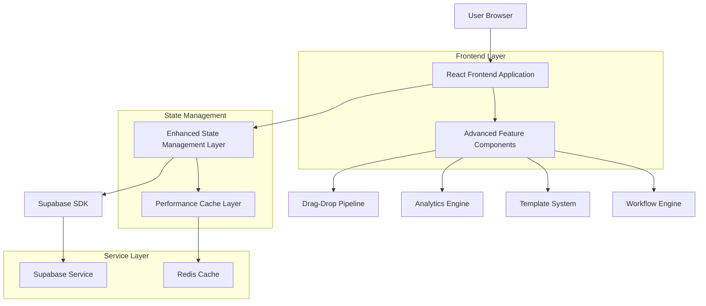
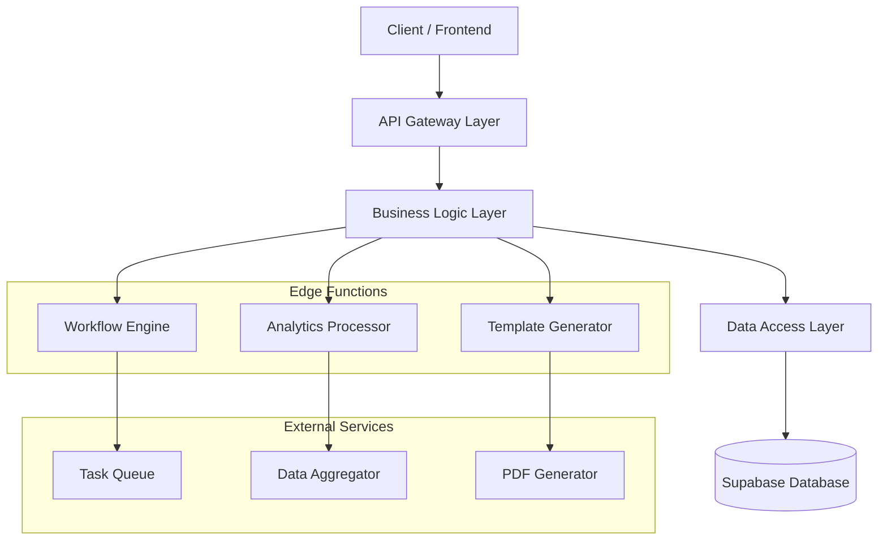
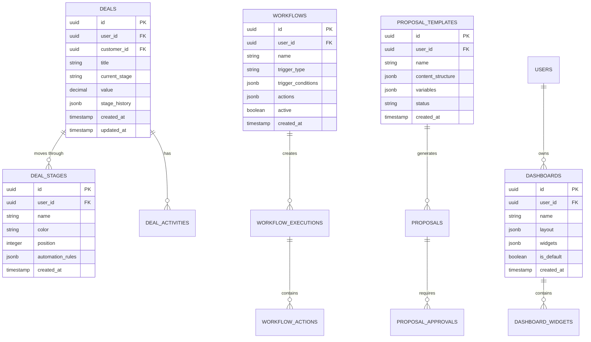

## 1. Architecture Design



## 2. Technology Description

- **Frontend**: React@18 + TypeScript@5.7 + Vite@6.0 + Tailwind CSS@3.4
- **State Management**: Zustand@5.0 + React Query@5.0 for server state
- **UI Components**: Radix UI + Framer Motion@11.0 for animations
- **Drag & Drop**: @dnd-kit/core@6.0 + @dnd-kit/sortable
- **Charts & Analytics**: Recharts@3.1 + D3.js@7.0 for advanced visualizations
- **Form Management**: React Hook Form@7.60 + Zod@3.22 validation
- **Backend**: Supabase (PostgreSQL + Auth + Storage + Edge Functions)
- **Caching**: React Query + Browser Cache API
- **Testing**: Vitest@2.0 + Playwright@1.55 + Testing Library

## 3. Route Definitions

| Route | Purpose |
|-------|---------|
| /dashboard | Enhanced dashboard with customizable widgets and analytics |
| /deals/pipeline | Advanced deal pipeline with drag-drop functionality |
| /analytics | Custom analytics dashboards and reporting |
| /proposals/templates | Proposal template management and editor |
| /workflows | Automated workflow configuration and monitoring |
| /search | Global search interface with advanced filtering |
| /settings/preferences | User preferences and customization options |
| /admin/workflows | Administrative workflow management (Power Users) |

## 4. API Definitions

### 4.1 Core API

**Deal Pipeline Management**
```
PUT /api/deals/{id}/stage
```

Request:
| Param Name | Param Type | isRequired | Description |
|------------|------------|------------|-------------|
| stage | string | true | New deal stage identifier |
| position | number | false | Position within stage |
| automated | boolean | false | Whether change was automated |

Response:
| Param Name | Param Type | Description |
|------------|------------|-------------|
| success | boolean | Operation status |
| deal | object | Updated deal object |
| stage_info | object | Stage metadata |

**Analytics Data**
```
GET /api/analytics/dashboard
```

Request:
| Param Name | Param Type | isRequired | Description |
|------------|------------|------------|-------------|
| dashboard_id | string | true | Dashboard configuration ID |
| date_range | string | false | Date range filter (7d, 30d, 90d) |
| filters | object | false | Additional filters |

Response:
| Param Name | Param Type | Description |
|------------|------------|-------------|
| widgets | array | Widget data and configurations |
| metrics | object | Calculated KPIs and metrics |
| charts | array | Chart data for visualizations |

**Workflow Engine**
```
POST /api/workflows/trigger
```

Request:
| Param Name | Param Type | isRequired | Description |
|------------|------------|------------|-------------|
| workflow_id | string | true | Workflow identifier |
| trigger_data | object | true | Data that triggered the workflow |
| context | object | false | Additional context information |

Response:
| Param Name | Param Type | Description |
|------------|------------|-------------|
| execution_id | string | Workflow execution identifier |
| status | string | Execution status |
| next_actions | array | Scheduled follow-up actions |

**Template System**
```
POST /api/proposals/generate
```

Request:
| Param Name | Param Type | isRequired | Description |
|------------|------------|------------|-------------|
| template_id | string | true | Template identifier |
| customer_id | string | true | Customer data source |
| variables | object | false | Custom template variables |

Response:
| Param Name | Param Type | Description |
|------------|------------|-------------|
| proposal_id | string | Generated proposal ID |
| content | object | Proposal content structure |
| pdf_url | string | Generated PDF download URL |

## 5. Server Architecture Diagram



## 6. Data Model

### 6.1 Data Model Definition



### 6.2 Data Definition Language

**Enhanced Deal Stages Table**
```sql
-- Create enhanced deal stages
CREATE TABLE deal_stages (
    id UUID PRIMARY KEY DEFAULT gen_random_uuid(),
    user_id UUID REFERENCES auth.users(id) NOT NULL,
    name VARCHAR(100) NOT NULL,
    color VARCHAR(7) DEFAULT '#3B82F6',
    position INTEGER NOT NULL,
    automation_rules JSONB DEFAULT '{}',
    created_at TIMESTAMP WITH TIME ZONE DEFAULT NOW(),
    updated_at TIMESTAMP WITH TIME ZONE DEFAULT NOW()
);

-- Create indexes
CREATE INDEX idx_deal_stages_user_id ON deal_stages(user_id);
CREATE INDEX idx_deal_stages_position ON deal_stages(user_id, position);

-- Enable RLS
ALTER TABLE deal_stages ENABLE ROW LEVEL SECURITY;
CREATE POLICY "Users manage own stages" ON deal_stages FOR ALL USING (auth.uid() = user_id);
```

**Workflows Table**
```sql
-- Create workflows table
CREATE TABLE workflows (
    id UUID PRIMARY KEY DEFAULT gen_random_uuid(),
    user_id UUID REFERENCES auth.users(id) NOT NULL,
    name VARCHAR(200) NOT NULL,
    trigger_type VARCHAR(50) NOT NULL,
    trigger_conditions JSONB NOT NULL DEFAULT '{}',
    actions JSONB NOT NULL DEFAULT '[]',
    active BOOLEAN DEFAULT true,
    created_at TIMESTAMP WITH TIME ZONE DEFAULT NOW(),
    updated_at TIMESTAMP WITH TIME ZONE DEFAULT NOW()
);

-- Create workflow executions table
CREATE TABLE workflow_executions (
    id UUID PRIMARY KEY DEFAULT gen_random_uuid(),
    workflow_id UUID REFERENCES workflows(id) NOT NULL,
    trigger_data JSONB NOT NULL,
    status VARCHAR(20) DEFAULT 'pending',
    started_at TIMESTAMP WITH TIME ZONE DEFAULT NOW(),
    completed_at TIMESTAMP WITH TIME ZONE,
    error_message TEXT
);

-- Create indexes
CREATE INDEX idx_workflows_user_id ON workflows(user_id);
CREATE INDEX idx_workflows_active ON workflows(user_id, active);
CREATE INDEX idx_workflow_executions_workflow_id ON workflow_executions(workflow_id);
CREATE INDEX idx_workflow_executions_status ON workflow_executions(status);

-- Enable RLS
ALTER TABLE workflows ENABLE ROW LEVEL SECURITY;
ALTER TABLE workflow_executions ENABLE ROW LEVEL SECURITY;

CREATE POLICY "Users manage own workflows" ON workflows FOR ALL USING (auth.uid() = user_id);
CREATE POLICY "Users view own executions" ON workflow_executions FOR SELECT USING (
    EXISTS (SELECT 1 FROM workflows WHERE workflows.id = workflow_executions.workflow_id AND workflows.user_id = auth.uid())
);
```

**Proposal Templates Table**
```sql
-- Create proposal templates table
CREATE TABLE proposal_templates (
    id UUID PRIMARY KEY DEFAULT gen_random_uuid(),
    user_id UUID REFERENCES auth.users(id) NOT NULL,
    name VARCHAR(200) NOT NULL,
    content_structure JSONB NOT NULL DEFAULT '{}',
    variables JSONB DEFAULT '{}',
    status VARCHAR(20) DEFAULT 'draft',
    created_at TIMESTAMP WITH TIME ZONE DEFAULT NOW(),
    updated_at TIMESTAMP WITH TIME ZONE DEFAULT NOW()
);

-- Create proposal approvals table
CREATE TABLE proposal_approvals (
    id UUID PRIMARY KEY DEFAULT gen_random_uuid(),
    proposal_id UUID REFERENCES proposals(id) NOT NULL,
    approver_id UUID REFERENCES auth.users(id) NOT NULL,
    status VARCHAR(20) DEFAULT 'pending',
    comments TEXT,
    approved_at TIMESTAMP WITH TIME ZONE,
    created_at TIMESTAMP WITH TIME ZONE DEFAULT NOW()
);

-- Create indexes
CREATE INDEX idx_proposal_templates_user_id ON proposal_templates(user_id);
CREATE INDEX idx_proposal_approvals_proposal_id ON proposal_approvals(proposal_id);
CREATE INDEX idx_proposal_approvals_approver_id ON proposal_approvals(approver_id);

-- Enable RLS
ALTER TABLE proposal_templates ENABLE ROW LEVEL SECURITY;
ALTER TABLE proposal_approvals ENABLE ROW LEVEL SECURITY;

CREATE POLICY "Users manage own templates" ON proposal_templates FOR ALL USING (auth.uid() = user_id);
CREATE POLICY "Users manage approvals" ON proposal_approvals FOR ALL USING (
    auth.uid() = approver_id OR 
    EXISTS (SELECT 1 FROM proposals WHERE proposals.id = proposal_approvals.proposal_id AND proposals.user_id = auth.uid())
);
```

**Custom Dashboards Table**
```sql
-- Create dashboards table
CREATE TABLE dashboards (
    id UUID PRIMARY KEY DEFAULT gen_random_uuid(),
    user_id UUID REFERENCES auth.users(id) NOT NULL,
    name VARCHAR(200) NOT NULL,
    layout JSONB NOT NULL DEFAULT '{}',
    widgets JSONB NOT NULL DEFAULT '[]',
    is_default BOOLEAN DEFAULT false,
    created_at TIMESTAMP WITH TIME ZONE DEFAULT NOW(),
    updated_at TIMESTAMP WITH TIME ZONE DEFAULT NOW()
);

-- Create indexes
CREATE INDEX idx_dashboards_user_id ON dashboards(user_id);
CREATE INDEX idx_dashboards_default ON dashboards(user_id, is_default);

-- Enable RLS
ALTER TABLE dashboards ENABLE ROW LEVEL SECURITY;
CREATE POLICY "Users manage own dashboards" ON dashboards FOR ALL USING (auth.uid() = user_id);

-- Insert default dashboard for new users
INSERT INTO dashboards (user_id, name, layout, widgets, is_default)
SELECT 
    auth.uid(),
    'Default Dashboard',
    '{"columns": 3, "rows": 4}',
    '[
        {"type": "deals_overview", "position": {"x": 0, "y": 0, "w": 2, "h": 1}},
        {"type": "revenue_chart", "position": {"x": 2, "y": 0, "w": 1, "h": 2}},
        {"type": "recent_activities", "position": {"x": 0, "y": 1, "w": 2, "h": 2}}
    ]',
    true
WHERE NOT EXISTS (SELECT 1 FROM dashboards WHERE user_id = auth.uid() AND is_default = true);
```
