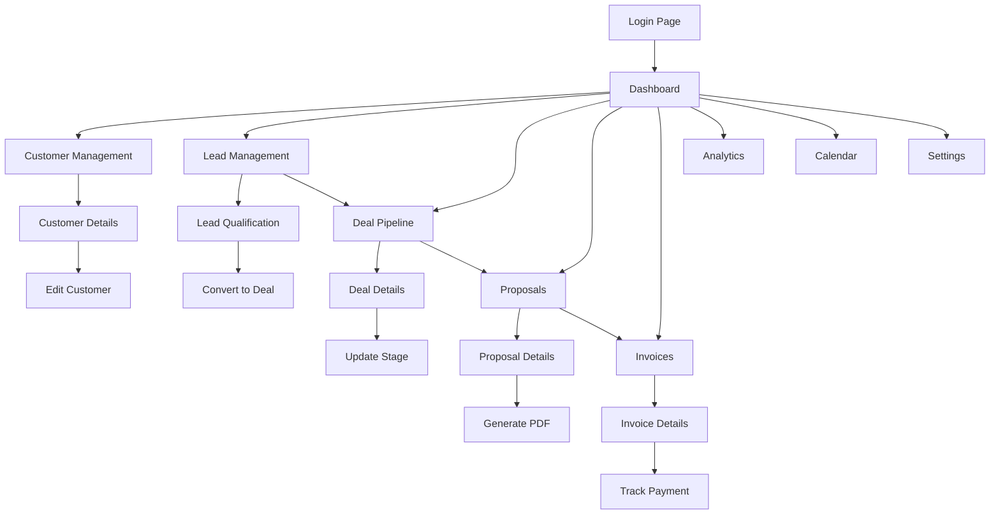

# Nawras CRM System - Product Requirements Document

## 1. Product Overview

Nawras CRM is a comprehensive Customer Relationship Management system designed to streamline sales processes, manage customer relationships, and drive business growth through data-driven insights.

The system addresses the core challenges of sales teams by providing centralized customer data management, automated lead tracking, visual deal pipelines, professional proposal generation, and comprehensive analytics. Target users include sales representatives, sales managers, and business owners who need to efficiently manage their sales operations and customer relationships.

The product aims to increase sales productivity by 40% and improve customer retention through better relationship management and data-driven decision making.

## 2. Core Features

### 2.1 User Roles

| Role                 | Registration Method                        | Core Permissions                                                         |
| -------------------- | ------------------------------------------ | ------------------------------------------------------------------------ |
| Sales Representative | Email registration with company invitation | Can manage own customers, leads, deals, create proposals and invoices    |
| Sales Manager        | Admin invitation with elevated privileges  | Can view team performance, access all data, manage users, view analytics |
| Administrator        | System-level access                        | Full system access, user management, system configuration                |

### 2.2 Feature Module

Our Nawras CRM system consists of the following main pages:

1. **Dashboard**: Overview metrics, recent activities, performance charts, quick actions
2. **Customer Management**: Customer profiles, contact information, interaction history, status tracking
3. **Lead Management**: Lead capture, qualification, scoring, conversion tracking
4. **Deal Pipeline**: Visual pipeline, stage management, drag-and-drop functionality, forecasting
5. **Proposal System**: Proposal creation, template management, PDF generation, tracking
6. **Invoice Management**: Invoice creation, payment tracking, PDF generation, status management
7. **Analytics Dashboard**: Sales metrics, revenue charts, performance reports, KPI tracking
8. **Calendar View**: Activity scheduling, meeting management, task tracking
9. **Settings**: User preferences, system configuration, profile management
10. **Login/Register**: Authentication, user onboarding, password management

### 2.3 Page Details

| Page Name           | Module Name           | Feature Description                                                                      |
| ------------------- | --------------------- | ---------------------------------------------------------------------------------------- |
| Dashboard           | Overview Metrics      | Display total customers, active deals, monthly revenue, conversion rates                 |
| Dashboard           | Recent Activities     | Show latest customer interactions, deal updates, proposal status changes                 |
| Dashboard           | Performance Charts    | Visualize sales trends, pipeline health, revenue forecasts using interactive charts      |
| Dashboard           | Quick Actions         | Provide shortcuts to create new customers, leads, deals, proposals                       |
| Customer Management | Customer Profiles     | Create, edit, view detailed customer information including contact details, company info |
| Customer Management | Interaction History   | Track all communications, meetings, calls, emails with timestamps                        |
| Customer Management | Status Management     | Update customer status (prospect, active, inactive), manage customer lifecycle           |
| Customer Management | Search & Filter       | Advanced search by name, company, status, date ranges with sorting options               |
| Lead Management     | Lead Capture          | Create new leads with source tracking, initial qualification data                        |
| Lead Management     | Lead Scoring          | Automatic scoring based on engagement, company size, budget, timeline                    |
| Lead Management     | Qualification Process | Multi-stage qualification with custom criteria and progress tracking                     |
| Lead Management     | Conversion Tracking   | Monitor lead-to-customer conversion rates and identify bottlenecks                       |
| Deal Pipeline       | Visual Pipeline       | Drag-and-drop interface showing deals across different stages                            |
| Deal Pipeline       | Stage Management      | Customize pipeline stages, set stage criteria, track stage duration                      |
| Deal Pipeline       | Deal Details          | Comprehensive deal information including value, close date, probability                  |
| Deal Pipeline       | Revenue Forecasting   | Predict revenue based on pipeline data and historical conversion rates                   |
| Proposal System     | Proposal Creation     | Rich text editor for creating detailed proposals with custom sections                    |
| Proposal System     | Template Management   | Pre-built templates for different proposal types, customizable layouts                   |
| Proposal System     | PDF Generation        | Generate professional PDF proposals with company branding                                |
| Proposal System     | Tracking & Analytics  | Monitor proposal views, time spent, acceptance rates                                     |
| Invoice Management  | Invoice Creation      | Generate invoices from deals/proposals with itemized billing                             |
| Invoice Management  | Payment Tracking      | Track payment status, due dates, send payment reminders                                  |
| Invoice Management  | PDF Generation        | Create professional PDF invoices with tax calculations                                   |
| Invoice Management  | Status Management     | Manage invoice lifecycle (draft, sent, paid, overdue)                                    |
| Analytics Dashboard | Sales Metrics         | Display key performance indicators, conversion rates, sales velocity                     |
| Analytics Dashboard | Revenue Charts        | Interactive charts showing revenue trends, forecasts, comparisons                        |
| Analytics Dashboard | Performance Reports   | Generate detailed reports on team performance, individual metrics                        |
| Analytics Dashboard | Export Functionality  | Export data and reports in various formats (PDF, Excel, CSV)                             |
| Calendar View       | Activity Scheduling   | Schedule meetings, calls, follow-ups with customer associations                          |
| Calendar View       | Task Management       | Create and track tasks, set reminders, assign to team members                            |
| Calendar View       | Integration           | Sync with external calendars (Google, Outlook)                                           |
| Settings            | User Preferences      | Customize dashboard layout, notification settings, display options                       |
| Settings            | Profile Management    | Update personal information, change password, manage preferences                         |
| Settings            | System Configuration  | Configure company settings, branding, email templates                                    |
| Login/Register      | Authentication        | Secure login with email/password, password reset functionality                           |
| Login/Register      | User Registration     | New user signup with email verification and profile setup                                |
| Login/Register      | Session Management    | Maintain secure sessions, automatic logout, remember me option                           |

## 3. Core Process

### Sales Representative Flow

1. Login to dashboard and review daily metrics and activities
2. Add new leads from various sources (website, referrals, cold outreach)
3. Qualify leads through structured process and convert promising ones to deals
4. Move deals through pipeline stages using drag-and-drop interface
5. Create and send proposals to qualified prospects
6. Generate invoices for closed deals and track payments
7. Schedule follow-up activities and maintain customer relationships

### Sales Manager Flow

1. Access dashboard with team performance overview
2. Review pipeline health and revenue forecasts
3. Analyze individual and team performance metrics
4. Generate reports for stakeholders and management
5. Manage team members and assign territories/accounts
6. Configure system settings and approval workflows

## 4. User Interface Design

### 4.1 Design Style

* **Primary Colors**: Blue (#3B82F6) for main actions and branding, White (#FFFFFF) for backgrounds

* **Secondary Colors**: Gray (#6B7280) for text and borders, Light Gray (#F9FAFB) for subtle backgrounds

* **Accent Colors**: Green (#10B981) for success states, Yellow (#F59E0B) for warnings, Red (#EF4444) for errors

* **Button Style**: Rounded corners (8px radius), subtle shadows, hover animations with color transitions

* **Typography**: Inter font family, 14px base size for body text, 16px for inputs, 24px+ for headings

* **Layout Style**: Card-based design with consistent 16px padding, top navigation with sidebar, responsive grid system

* **Icons**: Lucide React icon set with 20px default size, consistent stroke width, contextual colors

### 4.2 Page Design Overview

| Page Name           | Module Name      | UI Elements                                                                                                     |
| ------------------- | ---------------- | --------------------------------------------------------------------------------------------------------------- |
| Dashboard           | Overview Cards   | 4-column grid layout, white cards with subtle shadows, blue accent borders, large numbers with trend indicators |
| Dashboard           | Charts Section   | Full-width responsive charts using Recharts, blue/green color scheme, interactive tooltips, legend controls     |
| Customer Management | Data Table       | Sortable columns, search bar with filters, pagination, action buttons (edit/delete), status badges with colors  |
| Customer Management | Customer Form    | Two-column form layout, floating labels, validation states, blue submit button, cancel option                   |
| Lead Management     | Kanban Board     | Card-based layout with drag zones, color-coded by priority, progress indicators, quick action buttons           |
| Deal Pipeline       | Pipeline View    | Horizontal scrolling stages, deal cards with key info, drag-and-drop with visual feedback, stage totals         |
| Proposal System     | Rich Editor      | WYSIWYG editor with toolbar, template selector dropdown, preview mode, PDF generation button                    |
| Invoice Management  | Invoice Builder  | Itemized table with add/remove rows, automatic calculations, customer selector, payment terms dropdown          |
| Analytics Dashboard | Metrics Grid     | 3-column responsive layout, KPI cards with icons, percentage changes with color coding, export buttons          |
| Calendar View       | Calendar Grid    | Month/week/day views, event cards with customer colors, time slots, drag-and-drop scheduling                    |
| Settings            | Tabbed Interface | Left sidebar navigation, form sections with clear labels, save/cancel buttons, success notifications            |
| Login/Register      | Centered Form    | Single-column layout, company logo, input fields with icons, blue CTA button, forgot password link              |

### 4.3 Responsiveness

The application follows a mobile-first responsive design approach:

* **Desktop-first design** optimized for sales team productivity with full feature access

* **Tablet adaptation** with collapsible sidebar, touch-friendly buttons, optimized table layouts

* **Mobile optimization** with bottom navigation, swipe gestures, simplified forms, essential features prioritized

* **Touch interaction optimization** with 44px minimum touch targets, swipe actions, pull-to-refresh functionality

* **Breakpoints**: Mobile (320px-768px), Tablet (768px-1024px), Desktop (1024px+)

