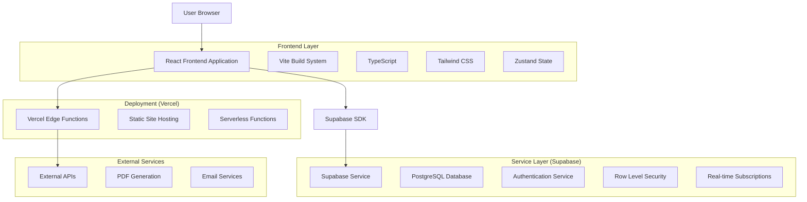
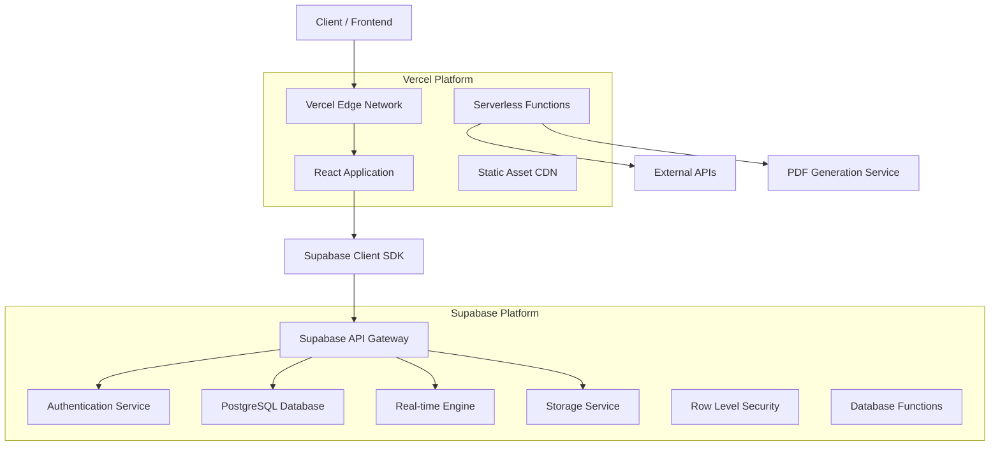
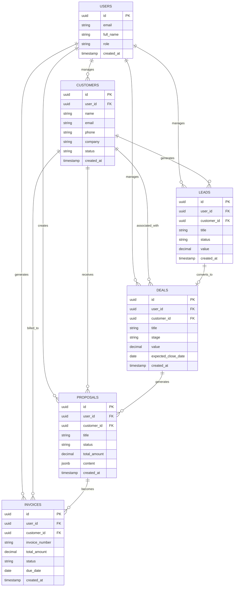

# Nawras CRM System - Technical Architecture Document

## 1. Architecture Design



## 2. Technology Description

* **Frontend**: React\@18.3.1 + TypeScript\@5.7.2 + Vite\@6.0.7 + Tailwind CSS\@3.4.17

* **State Management**: Zustand\@5.0.6

* **Routing**: React Router DOM\@6.28.0

* **UI Components**: Radix UI primitives + Lucide React\@0.468.0

* **Forms**: React Hook Form\@7.60.0 + Zod validation

* **Charts**: Recharts\@3.1.0

* **PDF Generation**: jsPDF\@3.0.2

* **Backend**: Supabase (PostgreSQL + Auth + Real-time)

* **Testing**: Playwright\@1.55.0

* **Deployment**: Vercel

## 3. Route Definitions

| Route                    | Purpose                                                    |
| ------------------------ | ---------------------------------------------------------- |
| /                        | Landing page with login redirect for authenticated users   |
| /login                   | Authentication page with email/password login              |
| /register                | User registration with email verification                  |
| /dashboard               | Main dashboard with metrics overview and quick actions     |
| /dashboard/customers     | Customer management with CRUD operations and search        |
| /dashboard/customers/:id | Individual customer profile with interaction history       |
| /dashboard/leads         | Lead management with qualification and conversion tracking |
| /dashboard/leads/:id     | Lead details with qualification progress and notes         |
| /dashboard/deals         | Deal pipeline with visual kanban board and drag-drop       |
| /dashboard/deals/:id     | Deal details with stage history and associated documents   |
| /dashboard/proposals     | Proposal management with creation and tracking             |
| /dashboard/proposals/:id | Proposal editor with rich text and PDF generation          |
| /dashboard/invoices      | Invoice management with payment tracking                   |
| /dashboard/invoices/:id  | Invoice details with payment history and PDF download      |
| /dashboard/analytics     | Analytics dashboard with charts and KPI metrics            |
| /dashboard/calendar      | Calendar view with activity scheduling and task management |
| /dashboard/settings      | User settings and system configuration                     |
| /dashboard/users         | User management (admin only) with role assignment          |

## 4. API Definitions

### 4.1 Core API

**Authentication APIs (Supabase Auth)**

```typescript
// Login
POST /auth/v1/token
```

Request:

| Param Name | Param Type | isRequired | Description        |
| ---------- | ---------- | ---------- | ------------------ |
| email      | string     | true       | User email address |
| password   | string     | true       | User password      |

Response:

| Param Name     | Param Type | Description                       |
| -------------- | ---------- | --------------------------------- |
| access\_token  | string     | JWT access token                  |
| refresh\_token | string     | Refresh token for session renewal |
| user           | object     | User profile information          |

**Customer Management APIs**

```typescript
// Get customers
GET /rest/v1/customers
```

Response:

| Param Name  | Param Type | Description                                  |
| ----------- | ---------- | -------------------------------------------- |
| id          | uuid       | Customer unique identifier                   |
| name        | string     | Customer full name                           |
| email       | string     | Customer email address                       |
| phone       | string     | Customer phone number                        |
| company     | string     | Customer company name                        |
| status      | string     | Customer status (prospect, active, inactive) |
| created\_at | timestamp  | Customer creation date                       |

```typescript
// Create customer
POST /rest/v1/customers
```

Request:

| Param Name | Param Type | isRequired | Description                              |
| ---------- | ---------- | ---------- | ---------------------------------------- |
| name       | string     | true       | Customer full name                       |
| email      | string     | true       | Customer email address                   |
| phone      | string     | false      | Customer phone number                    |
| company    | string     | false      | Customer company name                    |
| status     | string     | false      | Customer status (defaults to 'prospect') |

**Deal Management APIs**

```typescript
// Get deals with pipeline data
GET /rest/v1/deals
```

Response:

| Param Name            | Param Type | Description            |
| --------------------- | ---------- | ---------------------- |
| id                    | uuid       | Deal unique identifier |
| title                 | string     | Deal title/name        |
| customer\_id          | uuid       | Associated customer ID |
| stage                 | string     | Current pipeline stage |
| value                 | decimal    | Deal monetary value    |
| expected\_close\_date | date       | Expected closing date  |
| created\_at           | timestamp  | Deal creation date     |

```typescript
// Update deal stage
PATCH /rest/v1/deals/:id
```

Request:

| Param Name            | Param Type | isRequired | Description        |
| --------------------- | ---------- | ---------- | ------------------ |
| stage                 | string     | true       | New pipeline stage |
| value                 | decimal    | false      | Updated deal value |
| expected\_close\_date | date       | false      | Updated close date |

**Proposal Management APIs**

```typescript
// Generate proposal PDF
POST /rest/v1/rpc/generate_proposal_pdf
```

Request:

| Param Name   | Param Type | isRequired | Description                    |
| ------------ | ---------- | ---------- | ------------------------------ |
| proposal\_id | uuid       | true       | Proposal identifier            |
| template\_id | uuid       | false      | Template to use for generation |

Response:

| Param Name | Param Type | Description                |
| ---------- | ---------- | -------------------------- |
| pdf\_url   | string     | Generated PDF download URL |
| file\_size | integer    | PDF file size in bytes     |

## 5. Server Architecture Diagram



## 6. Data Model

### 6.1 Data Model Definition



### 6.2 Data Definition Language

**Users Table (extends Supabase auth)**

```sql
-- Create users table
CREATE TABLE public.users (
    id UUID PRIMARY KEY REFERENCES auth.users(id) ON DELETE CASCADE,
    email TEXT NOT NULL UNIQUE,
    full_name TEXT,
    role TEXT DEFAULT 'user' CHECK (role IN ('user', 'manager', 'admin')),
    created_at TIMESTAMPTZ DEFAULT NOW(),
    updated_at TIMESTAMPTZ DEFAULT NOW()
);

-- Create trigger for updated_at
CREATE OR REPLACE FUNCTION update_updated_at_column()
RETURNS TRIGGER AS $$
BEGIN
    NEW.updated_at = NOW();
    RETURN NEW;
END;
$$ language 'plpgsql';

CREATE TRIGGER update_users_updated_at BEFORE UPDATE ON public.users
    FOR EACH ROW EXECUTE FUNCTION update_updated_at_column();

-- Enable RLS
ALTER TABLE public.users ENABLE ROW LEVEL SECURITY;

-- Create policies
CREATE POLICY "Users can view own profile" ON public.users
    FOR SELECT USING (auth.uid() = id);

CREATE POLICY "Users can update own profile" ON public.users
    FOR UPDATE USING (auth.uid() = id);

-- Grant permissions
GRANT SELECT ON public.users TO anon;
GRANT ALL PRIVILEGES ON public.users TO authenticated;
```

**Customers Table**

```sql
-- Create customers table
CREATE TABLE public.customers (
    id UUID PRIMARY KEY DEFAULT gen_random_uuid(),
    user_id UUID REFERENCES auth.users(id) ON DELETE CASCADE NOT NULL,
    name TEXT NOT NULL,
    email TEXT NOT NULL,
    phone TEXT,
    company TEXT,
    status TEXT DEFAULT 'prospect' CHECK (status IN ('prospect', 'active', 'inactive')),
    created_at TIMESTAMPTZ DEFAULT NOW(),
    updated_at TIMESTAMPTZ DEFAULT NOW()
);

-- Create indexes
CREATE INDEX idx_customers_user_id ON public.customers(user_id);
CREATE INDEX idx_customers_email ON public.customers(email);
CREATE INDEX idx_customers_status ON public.customers(status);
CREATE INDEX idx_customers_created_at ON public.customers(created_at DESC);

-- Create trigger for updated_at
CREATE TRIGGER update_customers_updated_at BEFORE UPDATE ON public.customers
    FOR EACH ROW EXECUTE FUNCTION update_updated_at_column();

-- Enable RLS
ALTER TABLE public.customers ENABLE ROW LEVEL SECURITY;

-- Create policies
CREATE POLICY "Users manage own customers" ON public.customers
    FOR ALL USING (auth.uid() = user_id);

-- Grant permissions
GRANT SELECT ON public.customers TO anon;
GRANT ALL PRIVILEGES ON public.customers TO authenticated;
```

**Leads Table**

```sql
-- Create leads table
CREATE TABLE public.leads (
    id UUID PRIMARY KEY DEFAULT gen_random_uuid(),
    user_id UUID REFERENCES auth.users(id) ON DELETE CASCADE NOT NULL,
    customer_id UUID REFERENCES public.customers(id) ON DELETE SET NULL,
    title TEXT NOT NULL,
    status TEXT DEFAULT 'new' CHECK (status IN ('new', 'contacted', 'qualified', 'converted', 'lost')),
    value DECIMAL(12,2),
    source TEXT,
    notes TEXT,
    created_at TIMESTAMPTZ DEFAULT NOW(),
    updated_at TIMESTAMPTZ DEFAULT NOW()
);

-- Create indexes
CREATE INDEX idx_leads_user_id ON public.leads(user_id);
CREATE INDEX idx_leads_customer_id ON public.leads(customer_id);
CREATE INDEX idx_leads_status ON public.leads(status);
CREATE INDEX idx_leads_created_at ON public.leads(created_at DESC);

-- Create trigger for updated_at
CREATE TRIGGER update_leads_updated_at BEFORE UPDATE ON public.leads
    FOR EACH ROW EXECUTE FUNCTION update_updated_at_column();

-- Enable RLS
ALTER TABLE public.leads ENABLE ROW LEVEL SECURITY;

-- Create policies
CREATE POLICY "Users manage own leads" ON public.leads
    FOR ALL USING (auth.uid() = user_id);

-- Grant permissions
GRANT SELECT ON public.leads TO anon;
GRANT ALL PRIVILEGES ON public.leads TO authenticated;
```

**Deals Table**

```sql
-- Create deals table
CREATE TABLE public.deals (
    id UUID PRIMARY KEY DEFAULT gen_random_uuid(),
    user_id UUID REFERENCES auth.users(id) ON DELETE CASCADE NOT NULL,
    customer_id UUID REFERENCES public.customers(id) ON DELETE CASCADE NOT NULL,
    title TEXT NOT NULL,
    stage TEXT DEFAULT 'prospecting' CHECK (stage IN ('prospecting', 'qualification', 'proposal', 'negotiation', 'closed_won', 'closed_lost')),
    value DECIMAL(12,2) NOT NULL,
    probability INTEGER DEFAULT 50 CHECK (probability >= 0 AND probability <= 100),
    expected_close_date DATE,
    actual_close_date DATE,
    notes TEXT,
    created_at TIMESTAMPTZ DEFAULT NOW(),
    updated_at TIMESTAMPTZ DEFAULT NOW()
);

-- Create indexes
CREATE INDEX idx_deals_user_id ON public.deals(user_id);
CREATE INDEX idx_deals_customer_id ON public.deals(customer_id);
CREATE INDEX idx_deals_stage ON public.deals(stage);
CREATE INDEX idx_deals_expected_close_date ON public.deals(expected_close_date);
CREATE INDEX idx_deals_created_at ON public.deals(created_at DESC);

-- Create trigger for updated_at
CREATE TRIGGER update_deals_updated_at BEFORE UPDATE ON public.deals
    FOR EACH ROW EXECUTE FUNCTION update_updated_at_column();

-- Enable RLS
ALTER TABLE public.deals ENABLE ROW LEVEL SECURITY;

-- Create policies
CREATE POLICY "Users manage own deals" ON public.deals
    FOR ALL USING (auth.uid() = user_id);

-- Grant permissions
GRANT SELECT ON public.deals TO anon;
GRANT ALL PRIVILEGES ON public.deals TO authenticated;
```

**Proposals Table**

```sql
-- Create proposals table
CREATE TABLE public.proposals (
    id UUID PRIMARY KEY DEFAULT gen_random_uuid(),
    user_id UUID REFERENCES auth.users(id) ON DELETE CASCADE NOT NULL,
    customer_id UUID REFERENCES public.customers(id) ON DELETE CASCADE NOT NULL,
    deal_id UUID REFERENCES public.deals(id) ON DELETE SET NULL,
    title TEXT NOT NULL,
    status TEXT DEFAULT 'draft' CHECK (status IN ('draft', 'sent', 'viewed', 'accepted', 'rejected')),
    total_amount DECIMAL(12,2) NOT NULL,
    content JSONB,
    template_id UUID,
    sent_at TIMESTAMPTZ,
    viewed_at TIMESTAMPTZ,
    responded_at TIMESTAMPTZ,
    created_at TIMESTAMPTZ DEFAULT NOW(),
    updated_at TIMESTAMPTZ DEFAULT NOW()
);

-- Create indexes
CREATE INDEX idx_proposals_user_id ON public.proposals(user_id);
CREATE INDEX idx_proposals_customer_id ON public.proposals(customer_id);
CREATE INDEX idx_proposals_deal_id ON public.proposals(deal_id);
CREATE INDEX idx_proposals_status ON public.proposals(status);
CREATE INDEX idx_proposals_created_at ON public.proposals(created_at DESC);

-- Create trigger for updated_at
CREATE TRIGGER update_proposals_updated_at BEFORE UPDATE ON public.proposals
    FOR EACH ROW EXECUTE FUNCTION update_updated_at_column();

-- Enable RLS
ALTER TABLE public.proposals ENABLE ROW LEVEL SECURITY;

-- Create policies
CREATE POLICY "Users manage own proposals" ON public.proposals
    FOR ALL USING (auth.uid() = user_id);

-- Grant permissions
GRANT SELECT ON public.proposals TO anon;
GRANT ALL PRIVILEGES ON public.proposals TO authenticated;
```

**Invoices Table**

```sql
-- Create invoices table
CREATE TABLE public.invoices (
    id UUID PRIMARY KEY DEFAULT gen_random_uuid(),
    user_id UUID REFERENCES auth.users(id) ON DELETE CASCADE NOT NULL,
    customer_id UUID REFERENCES public.customers(id) ON DELETE CASCADE NOT NULL,
    deal_id UUID REFERENCES public.deals(id) ON DELETE SET NULL,
    proposal_id UUID REFERENCES public.proposals(id) ON DELETE SET NULL,
    invoice_number TEXT UNIQUE NOT NULL,
    total_amount DECIMAL(12,2) NOT NULL,
    tax_amount DECIMAL(12,2) DEFAULT 0,
    status TEXT DEFAULT 'draft' CHECK (status IN ('draft', 'sent', 'paid', 'overdue', 'cancelled')),
    due_date DATE,
    paid_date DATE,
    items JSONB,
    notes TEXT,
    created_at TIMESTAMPTZ DEFAULT NOW(),
    updated_at TIMESTAMPTZ DEFAULT NOW()
);

-- Create indexes
CREATE INDEX idx_invoices_user_id ON public.invoices(user_id);
CREATE INDEX idx_invoices_customer_id ON public.invoices(customer_id);
CREATE INDEX idx_invoices_deal_id ON public.invoices(deal_id);
CREATE INDEX idx_invoices_status ON public.invoices(status);
CREATE INDEX idx_invoices_due_date ON public.invoices(due_date);
CREATE INDEX idx_invoices_created_at ON public.invoices(created_at DESC);

-- Create trigger for updated_at
CREATE TRIGGER update_invoices_updated_at BEFORE UPDATE ON public.invoices
    FOR EACH ROW EXECUTE FUNCTION update_updated_at_column();

-- Enable RLS
ALTER TABLE public.invoices ENABLE ROW LEVEL SECURITY;

-- Create policies
CREATE POLICY "Users manage own invoices" ON public.invoices
    FOR ALL USING (auth.uid() = user_id);

-- Grant permissions
GRANT SELECT ON public.invoices TO anon;
GRANT ALL PRIVILEGES ON public.invoices TO authenticated;

-- Create function to generate invoice numbers
CREATE OR REPLACE FUNCTION generate_invoice_number()
RETURNS TEXT AS $$
DECLARE
    next_number INTEGER;
    invoice_num TEXT;
BEGIN
    SELECT COALESCE(MAX(CAST(SUBSTRING(invoice_number FROM 5) AS INTEGER)), 0) + 1
    INTO next_number
    FROM public.invoices
    WHERE invoice_number ~ '^INV-[0-9]+$';
    
    invoice_num := 'INV-' || LPAD(next_number::TEXT, 6, '0');
    RETURN invoice_num;
END;
$$ LANGUAGE plpgsql;
```

**Initial Data Setup**

```sql
-- Insert sample data for development
INSERT INTO public.users (id, email, full_name, role)
SELECT 
    gen_random_uuid(),
    'admin@nawrascrm.com',
    'System Administrator',
    'admin'
WHERE NOT EXISTS (SELECT 1 FROM public.users WHERE email = 'admin@nawrascrm.com');

-- Create sample customer statuses and deal stages as reference
CREATE TABLE IF NOT EXISTS public.customer_statuses (
    id SERIAL PRIMARY KEY,
    name TEXT NOT NULL UNIQUE,
    description TEXT,
    color TEXT DEFAULT '#6B7280'
);

INSERT INTO public.customer_statuses (name, description, color) VALUES
('prospect', 'Potential customer', '#F59E0B'),
('active', 'Active customer', '#10B981'),
('inactive', 'Inactive customer', '#6B7280')
ON CONFLICT (name) DO NOTHING;

CREATE TABLE IF NOT EXISTS public.deal_stages (
    id SERIAL PRIMARY KEY,
    name TEXT NOT NULL UNIQUE,
    description TEXT,
    order_index INTEGER,
    color TEXT DEFAULT '#3B82F6'
);

INSERT INTO public.deal_stages (name, description, order_index, color) VALUES
('prospecting', 'Initial contact and research', 1, '#6B7280'),
('qualification', 'Qualifying the opportunity', 2, '#F59E0B'),
('proposal', 'Proposal sent to customer', 3, '#3B82F6'),
('negotiation', 'Negotiating terms and pricing', 4, '#8B5CF6'),
('closed_won', 'Deal successfully closed', 5, '#10B981'),
('closed_lost', 'Deal lost to competitor or cancelled', 6, '#EF4444')
ON CONFLICT (name) DO NOTHING;
```

